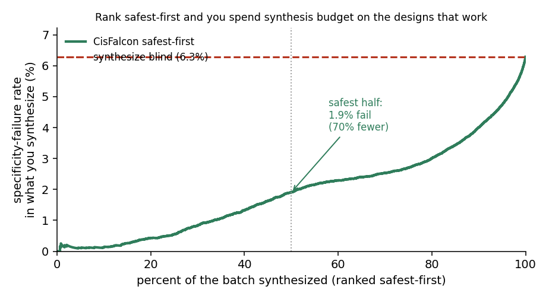
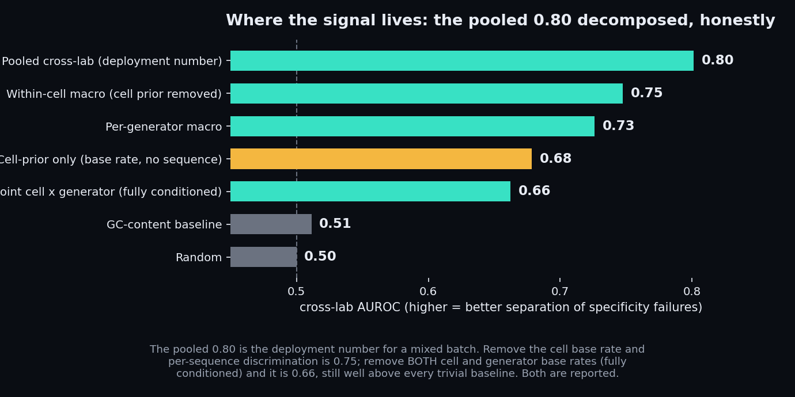
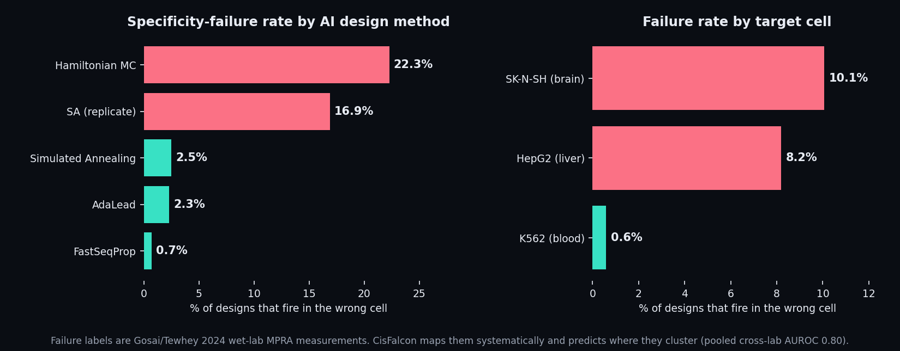
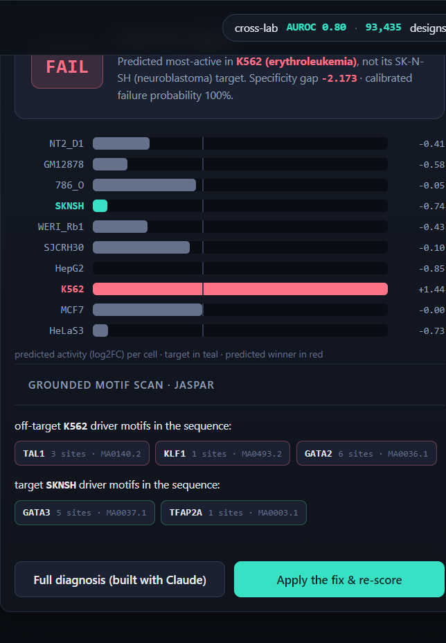

<!-- PITCH INTRO (voice this in your own words before publishing; the rest is factual/technical). -->

# CisFalcon

**Live tool: https://cisfalcon-lifesci.fly.dev/**


*A real Gosai/Tewhey design that CisFalcon flags as off-target, diagnoses, and closes the loop on: disrupt the K562 driver motifs (GATA1, TAL1, GATA2), install the HepG2 grammar (HNF4A, HNF1A, CEBPA), and the same external model moves the predicted specificity gap from failing to passing. This is an in-silico consistency check on one design, not wet-lab validation, captured live from the tool.*

## For judges (60 seconds)

**The problem.** AI now designs synthetic enhancers: short DNA meant to switch a gene on in one cell type and stay silent everywhere else, the targeting step of gene therapy. About **1 in 16** of those designs is secretly broken and fires in the wrong cell. You only find out after you synthesize and assay it, weeks and hundreds of dollars later.

**What it does.** CisFalcon reads a design and predicts that failure from sequence alone, before synthesis, so a lab spends its bench budget on the designs most likely to hold up.

**The number, reported the honest way.** Cross-lab **AUROC 0.80 on 93,435 designs from a different lab** (Gosai/Tewhey 2024), a different design model, and generators the scorer never saw, with zero sequence overlap. Rank safest-first and specificity failures in what you synthesize drop **70%** (6.29% to 1.91%); flag the riskiest 2% and about half truly fail (**7.8x** enrichment over the base rate). It is a triage ranker, not a hard gate, and every caveat is stated below and in `PREREG.md`.

**Try it, or reproduce it in one click:**
- Reproduce the 0.80 in your browser, no install: [](https://colab.research.google.com/github/belumume/cisfalcon/blob/main/reproduce_flagship.ipynb) fetches the committed scores from GitHub and prints AUROC 0.8013 in pure numpy.
- Live tool, no install: https://cisfalcon-lifesci.fly.dev/ (open Verify to see a real design batch scored and ranked live, click a flagged design to watch the closed-loop fix flip it or to run the live four-agent Claude diagnosis on it, or paste your own sequence). The Claude verifier runs in the product, not only the CLI: "Run Claude diagnosis" fires three Sonnet 5 reasoning lenses in parallel and an Opus 4.8 adjudicator, and the browser network tab shows the real `/api/diagnose` call return.
- Or locally, no GPU and no API key, about 1 second: `python reproduce_flagship.py` re-derives the 0.80 AUROC and the 7.8x triage straight from the committed per-design scores.
- Uncertainty, in one command: `python bootstrap_ci.py` prints the 95% CIs (design-level and the honest cluster bootstrap over cell x generator strata) and the paired difference vs trivial baselines, all excluding zero (`docs/bootstrap_ci.png`).
- Pre-registered threshold, full methodology, and the independent Claude Science re-derivation: `PREREG.md`.
- **How it was built (the Claude Code + Claude Science collaboration):** [`HOW-BUILT.md`](HOW-BUILT.md). A Claude multi-agent verifier plus custom epistemic hooks, independently audited by a separate Claude Science session that re-derived every number and caught a real reproduction-claim conflation. Judge-diffable audit table: [`docs/SCIENCE-AUDIT.md`](docs/SCIENCE-AUDIT.md).

**Why it matters.** Enhancers are the targeting element of brain / heart / immune enhancer-AAV gene therapy, where the field's own stated bottleneck is that many designs fail specificity. That is the spend CisFalcon triages, and it already runs on a brain-derived cell (the SKNSH neuroblastoma line, cross-lab 0.73; a primary-neuron MPRA is the honest next step).

---

A pre-synthesis failure-risk triage for AI-designed cell-type-specific enhancers. It reads a designed
DNA sequence and predicts, before any DNA is synthesized, whether the design will FAIL its intended
cell-type specificity in a wet-lab MPRA. It is a triage ranker, not a hard abort gate: it ranks and
flags the riskiest designs so a lab can deprioritize or redesign them before spending on synthesis.
Defensive use only; it does not design DNA.

Paste a designed enhancer, pick a target cell, and the tool returns the specificity verdict, a
per-cell activity chart, a JASPAR-grounded motif scan (which transcription-factor motifs are actually
present), a diagnosis from parallel Claude agents, and a closed loop: apply the prescribed motif edit
and re-score with the same external model to watch the predicted specificity gap move from failing to
passing. A batch mode ranks a whole set safest-first. No install, usable without the author present.

### The grammar it reads is disease grammar

CisFalcon grounds its motif diagnosis in disease biology. The lineage-driver transcription factors
behind the hero design's specificity failure are validated human disease genes, so the tool reads the
same regulatory grammar whose disruption causes disease: GATA1 (X-linked dyserythropoietic anemia /
thrombocytopenia, OMIM 300367), TAL1 (T-cell acute lymphoblastic leukemia), KLF1 (congenital
dyserythropoietic anemia), HNF4A (MODY1 diabetes, OMIM 125850), FOXA2 (congenital hyperinsulinism).
CisFalcon attaches the Mendelian disease to each of the ten erythroid and hepatocyte driver factors it
tracks (`webapp/backend/motifs.py`, `TF_DISEASE`).

Deeper than marginal motifs: GATA1 and TAL1 are obligate members of the erythroid pentameric complex
(GATA1-TAL1-LMO2-LDB1-E2A), which binds a single bipartite composite element, an E-box six to twelve
bases from a GATA site (Wadman et al. 1997, EMBO J). CisFalcon detects that assembled composite site
directly (`erythroid_composite_sites`), and the real hero failing design carries one (CACCTG, 8 bp,
TGATAA): the E-box and GATA sites sit at the exact spacing the complex requires, so they read as one
bound blood-cell regulatory unit inside a design that was meant for liver.

## What it does

Modern generative models design enhancers meant to be active in one target cell type and silent
elsewhere. Many still fire in the wrong cell. Synthesizing and assaying one design costs roughly
$250-1000 in direct materials and weeks of turnaround (a synthesis run plus the MPRA readout); the
economics figures elsewhere use a larger full-committed-spend basis per pursued design (synthesis plus
validation plus downstream follow-up, ~$950-3500, stated where cited). CisFalcon scores the sequence
first and predicts the failure, grounded in an external measured-activity model rather than self-report.

Concretely, on a real design from an independent lab optimized to be HepG2-specific, CisFalcon reads
the sequence alone and predicts the most-active cell will be K562 (not the HepG2 target), a specificity
gap of -3.0 (predicted FAIL). The wet-lab measurement confirms it: that design barely touches its HepG2
target (measured log2FC -0.1) and fires strongly in K562 (measured log2FC 6.5, roughly 90x on a linear
scale). See `demo.py`.

## Results (independently reproducible)

Cross-lab validation is the flagship: a frozen published activity model, scored on **93,435 designs from
a different lab, a different design process, and generators it never saw** (Gosai et al. 2024; the BODA
design framework built on the Malinois activity model, via AdaLead, Simulated Annealing, Hamiltonian MC,
FastSeqProp), with no sequence overlap with the model's training data.

| number | value | reproduce |
|---|---|---|
| cross-lab AUROC (n=93,435) | **0.8013**, 95% CI [0.796, 0.807] | `reproduce_flagship.py`, `bootstrap_ci.py` |
| vs trivial baselines (GC / length / random) | 0.51 / 0.50 / 0.50 | `bootstrap_ci.py` |
| fully-conditioned per-sequence signal | 0.66 | `cell_prior_baseline.py` |
| safest-half failure reduction | **70%** (6.29% to 1.91%) | `triage_curve.py` |
| riskiest-2% triage enrichment | **7.8x** (PPV 0.49) | `reproduce_flagship.py` |
| held-out calibration error (ECE) | 0.0031 | `fit_calibration.py` |



- **Cross-lab AUROC 0.8013, AUPRC 0.293** (n=93,435; base failure rate 6.29%). Beats trivial baselines
  decisively (GC-content 0.51, sequence-length 0.50, random 0.50).
- **The number carries its uncertainty** (`bootstrap_ci.py`, 2000 resamples): the design-level 95% CI is
  [0.796, 0.807]; the honest cluster bootstrap over the 24 cell x generator strata is [0.614, 0.895], wide
  by construction because the ranker is strong on failure-prone generators and near-chance on the
  best-optimized ones. Triage enrichment 7.74x [7.39, 8.14]; safest-half reduction 70% [68%, 72%]. The
  gap over every trivial baseline is +0.29 to +0.30 with each 95% CI excluding zero, so the separation is
  statistically real, not a large-n artifact.
- **The signal is per-sequence, not just a base-rate prior.** Within each target cell (the cell prior
  removed) the gate still separates failures at macro-AUROC 0.75; a cell-prior-only baseline (target-cell
  base rate, no sequence) reaches 0.68. Removing BOTH the cell and generator base-rates at once (the joint
  within-(cell x generator) stratum) leaves genuine per-sequence discrimination of 0.66, still well above
  0.50 and every trivial baseline. So the pooled 0.80 is the deployment number for a mixed batch and 0.66
  is the fully-conditioned per-sequence signal; both are reported, not just the higher one
  (`cell_prior_baseline.py`).


- **The failure risk it prints is calibrated, not asserted.** The emitted probability is fit by isotonic
  regression on held-out cross-lab data: held-out calibration error (ECE) is 0.0031, so a design it labels
  70% risk fails close to 70% of the time across this design population (reliability diagram in
  `docs/cisfalcon_calibration.png`; `fit_calibration.py`). It is a population-level estimate, calibrated
  marginally on the Gosai distribution and not conditioned per target cell. The fit uses the three
  measured cross-lab cells (K562, HepG2, SKNSH); for a design targeting one of the other cell types the
  tool still prints a probability but labels it extrapolated rather than calibrated.
- **The deployed two-head combination beats either model alone, with nothing trained.** A cheaper
  chromatin-accessibility model gets close cross-lab (0.789 vs the activity 0.802), a fair question for
  any reviewer. A zero-parameter, a-priori rank-average of the two frozen heads, fixed before the number
  was read, lifts the cross-lab AUROC to 0.806, above both single heads: the paired 95% CI on the
  difference over the best single head is [+0.003, +0.007] (excludes zero), and it beats accessibility
  alone by +0.018. The lift is small and reported as such, but it means neither single model is the
  ceiling, and the combination is leakage-immune and un-tunable (`ensemble_ci.py`).
- **A different-architecture model, never trained on any MPRA, agrees.** Cross-checked against
  AlphaGenome (Google DeepMind) using its predicted chromatin accessibility: on 240 designs its
  independent specificity gap agrees with CisFalcon's predicted gap at **Spearman 0.80** (Pearson 0.82),
  and on its own it separates the wet-lab failures at **AUROC 0.688** [95% CI 0.620, 0.752], above chance
  even used far outside its training distribution. This is not fully orthogonal (both models learn
  regulatory grammar from genomic data), so the honest independent floor is the 0.688, not the 0.80
  agreement; the point is that a model built on different data with a different objective, that never saw
  an MPRA, ranks the same designs in the same order. Method and boundaries in
  [`docs/independent-model-crosscheck.md`](docs/independent-model-crosscheck.md); reproduce with
  `alphagenome_crosscheck.py`.
- **Triage value (the operating point that matters):** rank designs by CisFalcon and synthesize the
  safest half first, and the specificity-failure rate in what you make drops from 6.29% to 1.91%, a
  **70% reduction in failures**. Flag the riskiest 10% for redesign and you capture 43% of all failures
  at 4.3x the base rate; tighten to the riskiest 2% and 49% of those truly fail (7.8x).
- Every cross-lab headline number here re-derives to 4 decimals directly from the committed per-design
  scores (`data/gosai_designed/designed_scored.csv`) with a plain rank-sum AUROC; it is not a pipeline artifact.
- **Independently reproduced.** A separate Claude Science session cloned this repo from scratch and re-derived
  every number to the decimal from the committed data alone (AUROC 0.8013, joint per-sequence 0.662, calibration
  ECE 0.0031, triage 7.75x, ScreenAudit 0.394). It is a fresh-harness reproduction on separate infrastructure,
  and it is what surfaced the final reproducibility fixes in this repo.

### The benchmark is public

The 93,435-design cross-lab set is packaged as a standalone, leakage-immune benchmark for the
pre-synthesis specificity-QC task the field has no shared test for:
`data/gosai_designed/designed_benchmark.csv` (designs, per-cell measured activity, a transparent
gap and fail label) with reproducible stratified and leave-cell-out splits. Full schema, provenance,
and citation live in [`BENCHMARK.md`](BENCHMARK.md). CisFalcon's 0.80 is the reference baseline; any
model can be scored against it.

### Research-track extension: variant-effect prediction (a second, independent test)

Beyond cell-type specificity, the same frozen model **ranks single-base variant effects** on a fully
independent saturation-mutagenesis benchmark it never saw (Kircher et al. 2019, GSE126550; 11,005 SNVs):
**K562 large-effect AUROC 0.88** (Pearson r = 0.58, n = 2,814), HepG2 0.64 (r = 0.29). It separates
high- from low-impact variants well, the same triage signal; it does not calibrate absolute effect size
(near-blind on LDLR, with an honest per-element breakdown in the doc). Model loading was confirmed
bit-identical to the flagship scorer, and the K562 headline reproduces from the committed per-SNV data
with one command. See [`docs/variant-effect-extension.md`](docs/variant-effect-extension.md) and [`satmut/`](satmut/).

### A finding: a reliability map of AI enhancer-design methods

Using the same committed data, CisFalcon produces a systematic result the scattered dataset does not give
on its own. Today's AI enhancer-design methods vary about **30x** in specificity-failure rate (FastSeqProp
0.7% to Hamiltonian MC 22.3%), and the disease-relevant targets are the hardest: brain (SK-N-SH, **10.1%**)
and liver (HepG2, 8.2%) designs fail 10 to 15 times more often than blood (K562, 0.6%), and the worst
single combination, Hamiltonian-MC brain enhancers, fails **1 in 3**. CisFalcon's discrimination is highest
exactly where the failures cluster (AUROC 0.92 on the worst generator). The failure labels are Gosai/Tewhey
wet-lab measurements; the systematic map and the frozen verifier that predicts it are the contribution.
Reproduce with `python findings_failure_modes.py`.



See [`docs/failure-modes.md`](docs/failure-modes.md).

Honest boundaries, stated up front:

- CisFalcon is a **triage ranker**; it is not sold as a hard abort-gate. At the 6.29% base rate a hard
  gate has poor precision (PPV 0.24 at recall 0.5). Its value is prioritization, and every operating point
  is reported.
- It is a **heterogeneous ranker**: strong where failures are common (Hamiltonian MC AUROC 0.92), near
  coin-flip on the best-optimized generators (FastSeqProp 0.62, AdaLead 0.61). The honest within-generator
  macro-average is 0.73; the pooled 0.80 benefits from cross-generator separation. Lead with the range.
- The in-distribution number (matched, 3-cell, out-of-fold: AUROC 0.896) is a sanity check; the
  cross-lab result is the headline. The in-distribution number carries a residual train/test leakage
  caveat (the atlas CV split removes exact duplicates
  but not near-duplicate generative families). The cross-lab result is immune by construction.

Full methodology, every caveat, and the pre-committed vs post-hoc labels are in `PREREG.md`.

## Brain-cell relevance, shown not argued

Enhancer specificity is the targeting element of brain / heart / immune enhancer-AAV gene therapy,
where the field's own stated bottleneck is that many designs fail specificity: Mich et al. 2025 report
about half of astrocyte / oligodendrocyte enhancers fail in vivo, and Ben-Simon et al. 2024 tested 682
enhancers selected for cortical-cell-type open-chromatin specificity and reached only ~30% success (so
about 70% fail), as reported in the mammalian-cortex enhancer-prediction benchmark (bioRxiv
2024.08.21.609075). CisFalcon already runs on a
brain-derived line. Restricting the committed cross-lab scores to the SKNSH neuroblastoma designs
(`python brain_triage.py`, no GPU): base failure rate 10.06%, cross-lab AUROC 0.73; synthesize the
safest-ranked half and the brain-cell failure rate drops to 4.19% (**58% fewer**); the riskiest-2%
flag is 48% real failures (4.8x). These are softer than the pooled numbers and reported as-is (SKNSH
is a brain-derived cancer line, an in-vitro stand-in; a primary cortical-neuron MPRA is the honest
next step). And it works live on a real brain design:



A Gosai design built for the SKNSH brain line, flagged from sequence alone: predicted most-active in
K562 (a blood cell), not its neuroblastoma target, specificity gap -2.17, calibrated failure
probability 100%, with the off-target K562 driver motifs (TAL1 / KLF1 / GATA2) named in the sequence.

## How it works

1. **Gate (`gate.py`)** - the frozen atlas DHS64-MPRA activity models (Castillo-Hair et al. 2025), three
   shipped fold models, ensembled. Input is a 500 bp one-hot sequence; output is predicted log2FC across
   12 human cell lines. Nothing is trained or fine-tuned here.
2. **Transparent failure label** - a design FAILS specificity iff it is not most-active in its intended
   target: `gap = log2FC(target) - max(off-target log2FC); FAIL := gap <= 0`. Defined directly from the
   measured activity, independent of any opaque score.
3. **Agent layer (`verifier.py`)** - four Claude agents that turn a bare FAIL into a concrete mechanistic
   diagnosis: which off-target cell wins and which driver motifs to ablate or strengthen, grounded in the
   external wet-lab-trained predictions. A measured ablation (`run_ablation.py`) shows the agents do not
   improve classification accuracy over the deterministic gate; their value is the diagnosis a bare score
   and a generic AI reviewer cannot give. The ranking accuracy comes from the gate; the agents add the
   redesign guidance. It is a fan-out to three independent Sonnet 5 lenses (mechanism, precedent,
   adversary) and a fan-in to one Opus 4.8 adjudicator, on the raw Messages API. This layer runs live
   in the deployed tool at `/api/diagnose`, not only in the CLI: "Run Claude diagnosis" on any design
   returns the three reviews and the adjudicated verdict, visible in the browser network tab.

## Reproduce

```bash
# gate + demo (needs TensorFlow 2.14; models via the download script below)
python demo.py            # full run incl. the agent layer (needs an Anthropic API key)
python demo.py --no-agents # gate-only, no API
```

- The 3 fold models and the designed benchmark are large. The full cross-lab GPU run is the Kaggle
  kernel `ubaidullahshuaib/cisfalcon-gosai-crosslab`, reading the Kaggle dataset
  `ubaidullahshuaib/cisfalcon-designed-benchmark` (ships the benchmark CSV + the 3 MPRA fold models).
- Source data: atlas models (Zenodo 17410822), Gosai et al. cross-lab MPRA (Zenodo 10698014).
- Per-design scores used for every headline number: `data/gosai_designed/designed_scored.csv`.

Repository guide (the no-GPU scripts a reviewer can run straight from the committed data):

| script | what it produces |
|---|---|
| `reproduce_flagship.py` | the flagship AUROC 0.80, triage 7.8x, and safest-half 70%, from committed scores |
| `bootstrap_ci.py` | 95% CIs (design + cluster) and the paired difference vs trivial baselines |
| `triage_curve.py` | the safest-first triage-value curve (`docs/triage_curve.png`) |
| `brain_triage.py` | the SKNSH brain-cell triage operating point |
| `ensemble_ci.py` | the frozen two-head ensemble (activity + accessibility) and its paired CI vs the best single head |
| `cell_prior_baseline.py` | the fully-conditioned per-sequence signal 0.66 (cell/generator prior removed) |
| `threshold_robustness.py` | AUROC stability across the fail-label threshold |
| `fit_calibration.py` | isotonic calibration fit + held-out ECE 0.0031 |
| `verifier.py` | the four-agent diagnosis harness; `gate.py` the frozen encoder + ensemble |
| `PREREG.md` | frozen methodology, every caveat, pre-committed vs post-hoc labels |

## Generality

The same verifier pattern (a deterministic domain gate plus agent diagnosis, checked against external
measured ground truth) applies to a second, disjoint domain: `screenaudit/` re-derives and flags the
hit calls of published CRISPR screens (BioGRID ORCS). Run on live ORCS data across independent
essentiality (dropout) screens of the same cell line, published-hit agreement is heterogeneous and
often poor: mean Jaccard 0.39, from 0.69 (HEK293-A, reproducible) down to 0.14 (K-562, severely
discordant) over four cell lines. Independent labs share only about 39% of their combined hit calls,
and a matched-hit-count control confirms the worst cases are genuine gene-identity disagreement rather
than a threshold difference. The same harness produces a real external-ground-truth number in a second
domain, and flags which published hit lists are trustworthy.

## Safety

CisFalcon is a defensive falsifier: it predicts FAILURE to prevent wasted synthesis. The predictor is a
public, already-released model, and CisFalcon exposes no learned generative model and runs no
optimization search over sequences. The closed-loop "fix" is a bounded, deterministic, rule-based motif
edit: it ablates the specific off-target driver motifs the JASPAR scan named and inserts the target
cell's canonical motifs from a fixed lookup, then re-scores with the same frozen model as an in-silico
consistency check on the diagnosis (does correcting the flagged problem flip the prediction?). That is
textbook motif substitution, not a novel design capability or an optimizer, and the edited sequence is an
interpretability artifact rather than a synthesis recommendation. We acknowledge the dual-use nature of
any specificity predictor openly; the net effect here is a read-out that reduces spent effort on doomed
designs.

## License

MIT. See `LICENSE`.
