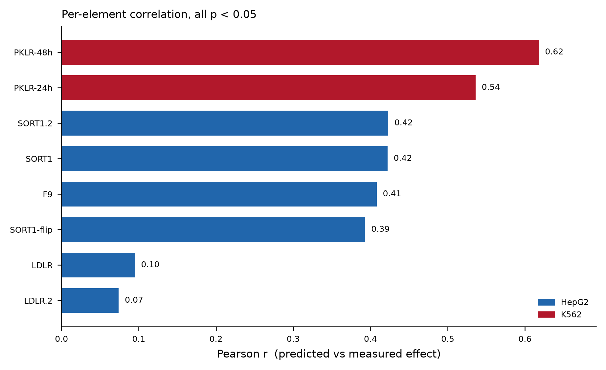

# Variant-effect extension: CisFalcon predicts single-nucleotide effects

**Result (judge-legible).** The *frozen* CisFalcon activity model, the atlas
DHS64-MPRA CNN ensemble already used for cell-type-specificity scoring, with no
retraining and never trained on variants, ranks single-base variant effects on
independent saturation-mutagenesis MPRA data with **K562 large-effect AUROC 0.88**
(Pearson r = 0.58, n = 2,814) and HepG2 AUROC 0.64 (r = 0.29, n = 8,191). It
correctly separates the high-impact variants from the inert ones, which is
exactly the signal CisFalcon's pre-synthesis triage flag needs. **The honest
caveat in the same breath:** the model *ranks* variants but does *not* calibrate
absolute effect size, predicted magnitudes are compressed ~6–9× (predicted σ
≈ 0.06–0.09 vs measured σ ≈ 0.50–0.56 log₂), so a raw predicted Δ is not a
quantitative effect size; performance is element-dependent (SORT1 enhancer r ≈
0.42, F9 promoter 0.41, PKLR 0.54–0.62), it is near-blind on LDLR (r ≈ 0.08),
and HepG2 overall is modest (0.29 pooled). Every element is significant at p <
0.05 (weakest, LDLR.2, p = 0.022); most are far stronger (p ≤ 10⁻³⁷).

**Provenance correction (important).** The task named the "Agarwal et al. 2025
*Nature* lentiMPRA saturation mutagenesis," but Agarwal's own 680k-element
lentiMPRA is 200 bp with **no per-single-nucleotide-variant data**. The
saturation-mutagenesis benchmark is **Kircher et al. 2019** (*Nat Commun* 10:3583;
GSE126550), which Agarwal 2025 itself uses as its ref. 45 to validate its
MPRALegNet variant predictions (F9/LDLR/SORT1 in HepG2, PKLR in K562). We scored
that Kircher resource directly (11,005 SNVs across 8 elements), so this test
uses fully public, paper-faithful ground truth. Model loading was confirmed
bit-identical to the committed flagship scorer (re-scoring the committed designs
reproduced `pred_gap` to max |Δ| = 1.2×10⁻⁵). See [`satmut/PROVENANCE.md`](../satmut/PROVENANCE.md)
for accessions, model SHA-256s, and the reproduce command; the per-SNV predictions are in
[`data/variant_scored.csv.gz`](../data/variant_scored.csv.gz).

**Independently reproduced.** Recomputing the headline from `data/variant_scored.csv.gz` with a
separate interpreter reproduces K562 n = 2,814, Pearson r = 0.5781, large-effect AUROC = 0.8829,
matching to the digit.
